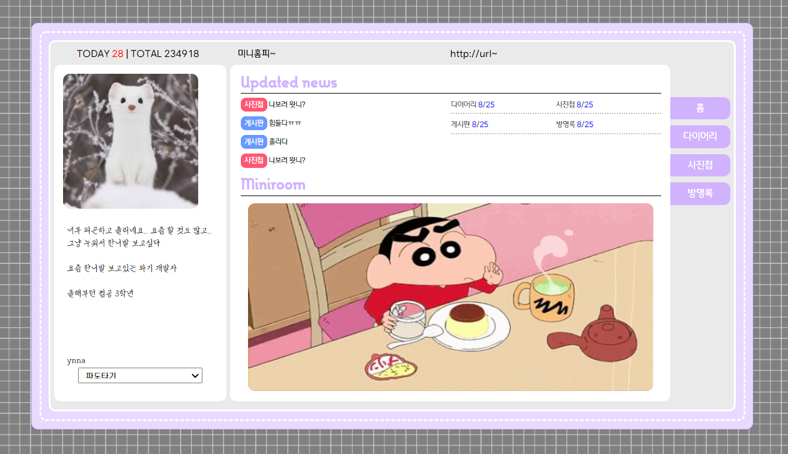
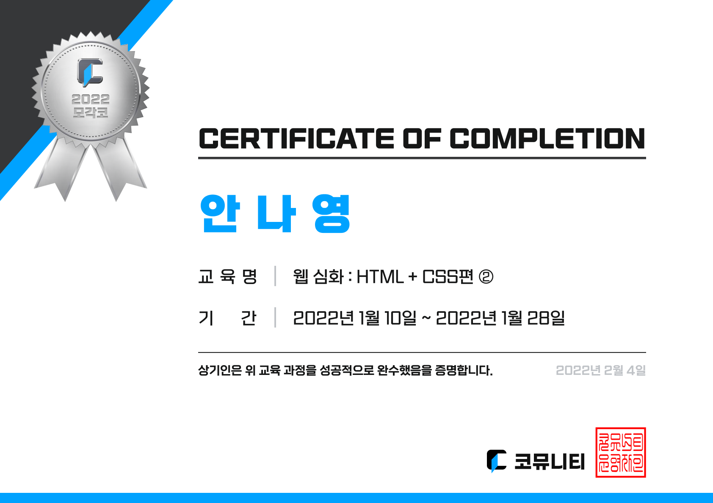

<h1>나만의 미니 홈페이지 만들기</h1>

<table> 
  <tr>
    <td>프로젝트명</td>
    <td>미니 홈페이지</td>
    <td>제작기간</td>
    <td>2022.01.10 ~ 2022.01.28, 매주 평일 (15일)</td>
  </tr>
  <tr>
    <td>참여인원</td>
    <td>1명</td>
    <td>개발환경</td>
    <td>HTML, CSS, JavaScript</td>
  </tr>
  <tr rowspan = 2>
    <td>목적</td>
    <td colspan = 3>
      1. HTML, CSS 학습 
      2. 웹 퍼블리싱에 대한 이해
    </td>
  </tr>
  <tr rowspan = 3>
    <td>구현내용</td>
    <td colspan = 3>
      1. 미니홈페이지의 설계 및 디자인 
      2. 화면 넘기기 
      3. 홈페이지에 txt 파일 업로드
    </td>
  </tr>
  <tr>
    <td>특이사항</td>
    <td>대외활동</td>
    <td>활동 이름</td>
    <td>2022 모각코 웹<HTML + CSS>심화 1월 과정</td>
  </tr>
</table>

<h2>날짜별 코드</h2>
https://github.com/NadudAn/mini-hompage-log/

<h2>실행결과</h2>

주소 또는 사진을 클릭하면 홈페이지로 이동합니다.

<h2>2022 모각코 웹 HTML + CSS 심화 1월과정 수료증</h2>

